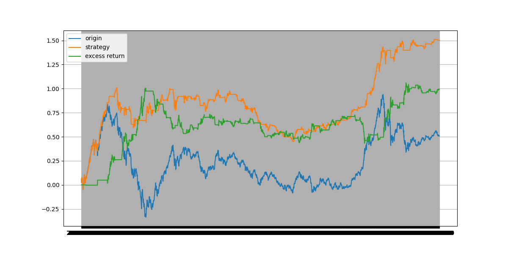
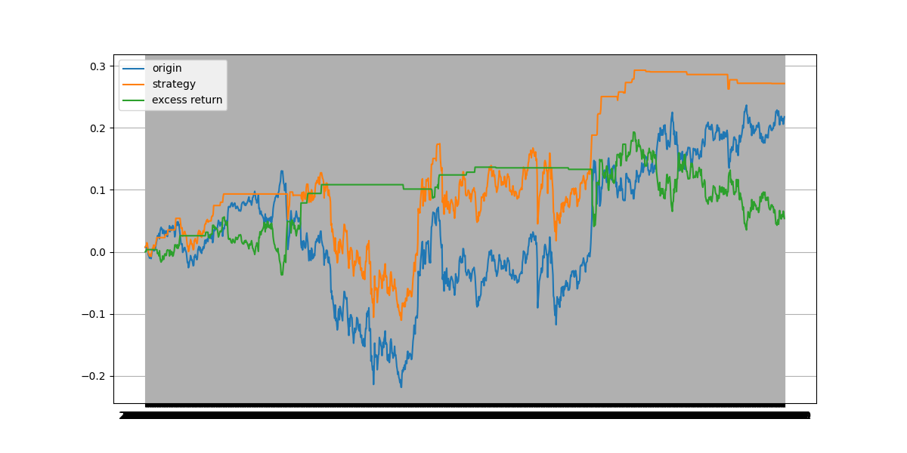

## DQN研报复现
### 项目介绍
复现华泰证券《强化学习初探与DQN择时》研报中的DQN模型与效果

项目架构如下:
- models(文件夹): 存储不同组随机数产生的DQN模型
- results(文件夹): 存储复现择时结果
- Agent: DQN类
- Config: 项目配置
- Data: 数据文件
- Market: StockTradeEnv
- Start: 运行开始的文件
- requirements: 安装所需库
### 模型介绍
受到华泰上述研报和GitHub高星仓库FinRL的影响，开发者希望通过强化学习方法做择时策略

项目流程如下:
- Data文件，读取上证指数历史数据(data.csv已经存放了预处理后的数据，直接读取即可)，
如果需要改变数据源，需要手动调tushare的token并获取所需数据并进行预处理
- 预处理采用当日开高收低价与前252个交易日收盘价的Z-score标准化
- Train阶段，初始化两个神经网络，eval_net估计 t 时的 Q value T1(t时若干天后收益情况),target_net 估计 t+1 时的 Q value T2(t+1时若干天后的收益情况), target_net的参数在训练每隔一定次数后复制为eval_net的参数
- loss 为 T2 + r1(真实奖励) 与 T1的差值, loss 越小，说明网络对未来的估计越准确，优化loss，使之变小
- Test阶段，由于随机数种子对结果的影响大，Start 文件中用了多组(10组)随机数种子来合成信号交易

具体见原文详细流程
目前复现效果不佳，表现不达研报预期，部分随机数种子产生的训练集上表现如图

测试集上如图


### 项目使用
如果需要更改数据,请使用Data模块

运行Start.py文件

启动visdom可视化

```terminal
python -m visdom.server
# nohup python -m visdom.server &    # 后台开启
```
在后台开启visdom后，实时过程查看网址: localhost:8097
### 项目进度
v0.1.0(已完成)  完成交易员,交易环境,强化学习基本算法的开发

v0.1.1(未完成)  调试超参数,尽可能复现模型

v0.1.2(未完成)  GPU加速功能

v0.1.0(未完成)  特征工程,将遗传规划等方法用于因子挖掘,将因子加入Env的state中

v0.2.0(未完成)  将单标的扩展到多标的算法
